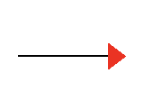

# Lab00 - Introduction and Setup

[Ctrl + Shift + V to see the rendered version of this file]

In this lab you will draw a line of size 100 pixels using simplecpp

<center>

</center>

---

## Your Task

Your must write the implementation in the following file.
```
line.cpp
```

Please edit the code in the given area and do not edit anywhere else.

Hint: Write the following code in the given area:
```
forward (100);
```

Do not worry if you do not understand it. We will catchup during lectures and in the next lab. 

When you run your code, you will see the line drawn as given above. 

---

## Directory Structure

```
line.cpp          # implement your solution for stairs here
README.md        # This file (DO NOT MODIFY)
include          # Supporting files of simplecpp (DO NOT MODIFY)
lib              # Supporting files of simplecpp (DO NOT MODIFY)
Makefile         # Build automation
```
# Make Commands

```
make             # Build and Run Tests
make build       # Build
make runtests    # Run Tests
make clean       # Clean Temporary Files
```
Please read Makefile to understand the above commands!

# VS Code interface

## Opening the Correct Folder in VS Code
You can open this folder in VS Code. The problem folder is configured to enable debugging. You must open the main problem folder, not a single file and not any subfolder inside it. The correct folder is the one that contains a folder named `.vscode`, another folder named `tests`, and your source code files. 

## Running the Program Using Debug Mode
- Click `Run and Debug` icon in the left sidebar > select the testcase from the `Launch` dropdown and click `Start Debugging` i.e. the green color play icon. 
- You can switch between different testcases i.e. (test 1), (test 2), etc. using this `Launch` dropdown.
- To run a testcase of your choice i.e. using your desired input, select `Launch ... (custom input)` from the `Launch` dropdown.
- After execution, the program output appears in the `Terminal` panel. Make sure you are viewing the `Terminal`, not the `Debug Console`.
- You may place breakpoints to pause the program at any desired location. To add a breakpoint, click on the left side of the code next to a line number. A red dot will appear. When you run the program, it will stop at that line so you can see how the program is executing step by step.

## Running all Testcases and view status
- Click on `Terminal` > `Run Task` > `Run all ... tests`. All test cases are executed one by one automatically. For each test case, the report displays the test number, whether it passed or failed, the expected output, and the actual output produced by your program in the `Terminal`.


# General Instructions

- Read all .h, .cpp files, and complete problem statement carefully before starting.
- Do not include any additional header files.
- Understand the input and output format and follow it exactly. Do not print extra messages, prompts, or debugging output.
- Do not hardcode values based on sample test cases.
- Do not modify files other than the specified files. Any other changes will not be considered during evaluation.
- Use meaningful variables function names.
- You are expected to submit an efficient implementation. Inefficient solutions will lose marks.
- You may create helper functions and declare global variables within the file.
- We may call your function(s) with with different inputs to test its  correctness and efficiency in a single run. Therefore, ensure that any global state is properly reset between calls if necessary.
